# Huong Dan Ve Bieu Do Waves Va Marketplace

Tai lieu nay huong dan cach ve cac bieu do phan tich thiet ke cho hai phan:

- **Waves**: nhan tin, hoi thoai, gui media, realtime, tim kiem tin nhan, seen, reaction, ghim/thu hoi/xoa tin nhắn, goi audio/video va call log.
- **Marketplace**: dang tin, xem/tim/loc tin, chi tiet tin, luu tin, lien he nguoi ban qua Waves, quan ly tin ban, sua/xoa/danh dau da ban, bao cao, boost/quang ba va moderation.

Muc tieu la de nguoi chua quen ve bieu do van co the lam theo. Moi phan deu co: ve de lam gi, dung ky hieu nao, ve noi dung nao cho du an SurfSocialMedia, va co mau de chep sang cong cu ve.

## 1. Cach Lay Thong Tin Tu Du An

Truoc khi ve, can biet he thong co nhung man hinh, API, kho du lieu va dich vu nao.

Nguon tham chieu trong repo:

- Web UI Waves: `surf-client/src/pages/Waves.tsx`
- Web UI Marketplace: `surf-client/src/pages/MarketPage.tsx`
- Call UI/provider: `surf-client/src/components/call/GlobalCallProvider.tsx`
- API hoi thoai/tin nhan: `surf-server/src/routes/conversations.ts`, `surf-server/src/routes/messages.ts`
- API goi audio/video: `surf-server/src/routes/calls.ts`
- API marketplace: `surf-server/src/routes/marketplace.ts`
- Socket call handler: `surf-server/src/realtime/handlers/call.handlers.ts`
- Kieu du lieu chinh: `surf-server/src/types/conversation.ts`, `surf-server/src/types/message.ts`
- Danh sach yeu cau nghiep vu: `docs/jira-import.csv`

Cac thanh phan chinh:

| Thanh phan | Vai tro |
| --- | --- |
| React Web Client | Hien thi Waves, Marketplace, form, modal, danh sach va nut thao tac |
| Express API Server | Xu ly request REST, kiem tra dang nhap, kiem tra quyen, doc/ghi Firestore |
| Firestore | Luu `users`, `conversations`, `messages`, `marketplace`, `marketplace_reports`, `boost_campaigns`, `notifications` |
| Socket.IO | Day su kien realtime: `message:new`, unread count, typing, read receipt, call invite/signal/end |
| Cloudinary/Firebase Storage | Luu anh, file, audio cua chat va anh san pham marketplace |
| LiveKit | Tao token/phong goi audio/video |
| Firebase Auth | Xac thuc nguoi dung |

## 2. Quy Uoc Ve Chung

Dung cac quy uoc nay cho tat ca bieu do de bao cao nhat quan.

| Khai niem | Ky hieu nen dung | Vi du trong bai |
| --- | --- | --- |
| Actor | Hinh nguoi hoac o ngoai he thong | `Nguoi mua`, `Nguoi ban`, `Admin`, `Firebase Auth` |
| Process | Hinh tron hoac hinh chu nhat bo goc | `Gui tin nhan`, `Tao listing` |
| Data store | Hinh database hoac hai duong song song | `Firestore: messages`, `Firestore: marketplace` |
| Data flow | Mui ten co nhan | `noi dung tin nhan`, `listingId`, `mediaUrl`, `call token` |
| Boundary | Khung bao quanh module | `Surf Client`, `Surf Server`, `Realtime Socket`, `External Services` |

Cach dat ten:

- Process nen bat dau bang dong tu: `Tai danh sach hoi thoai`, `Tim listing`, `Tao cuoc goi`.
- Data flow nen la du lieu cu the: `conversationId`, `message payload`, `bo loc tim kiem`, `anh san pham`.
- Data store nen ghi ro collection: `Firestore: conversations`, khong chi ghi chung chung `Database`.

## 3. Phan Ra Chuc Nang FDD/BFD

### 3.1. Bieu do nay dung de lam gi?

FDD/BFD cho thay he thong co nhung chuc nang lon nao va moi chuc nang lon duoc chia nho ra sao. Day la bieu do de nguoi cham nhin vao thay pham vi cua phan Waves va Marketplace.

### 3.2. Cach ve tung buoc

1. Ve o goc tren cung: `SurfSocialMedia`.
2. Tach thanh hai nhanh lon: `Waves` va `Marketplace`.
3. Voi moi nhanh lon, tach thanh cac nhom chuc nang con.
4. Neu can chi tiet hon, tach moi nhom thanh cac thao tac nho.

### 3.3. Noi dung nen ve

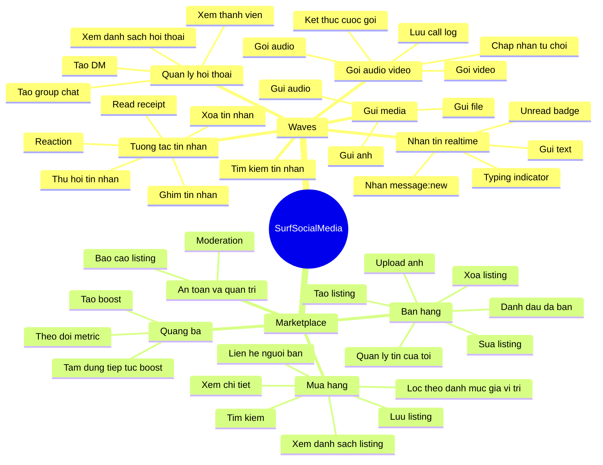

Neu ve bang draw.io: dung hinh chu nhat cho tung node, noi bang duong thang. Goc trai la module lon, ben phai la chuc nang con.

## 4. BFD Muc Module

### 4.1. BFD Waves

BFD muc module cho thay chuc nang Waves di qua cac khoi nao. Ban khong can ve tung field, chi can ve dong xu ly lon.

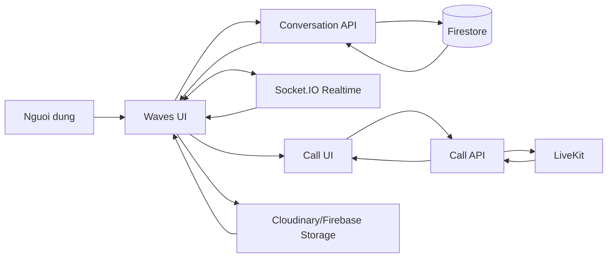

Giai thich khi trinh bay:

- `Waves UI` tai hoi thoai va tin nhan qua `Conversation API`.
- Tin nhan realtime di qua `Socket.IO`.
- Media duoc upload len `Cloudinary/Firebase Storage`, sau do URL duoc luu trong message.
- Goi audio/video xin token qua `Call API`, ket noi media qua `LiveKit`.

### 4.2. BFD Marketplace

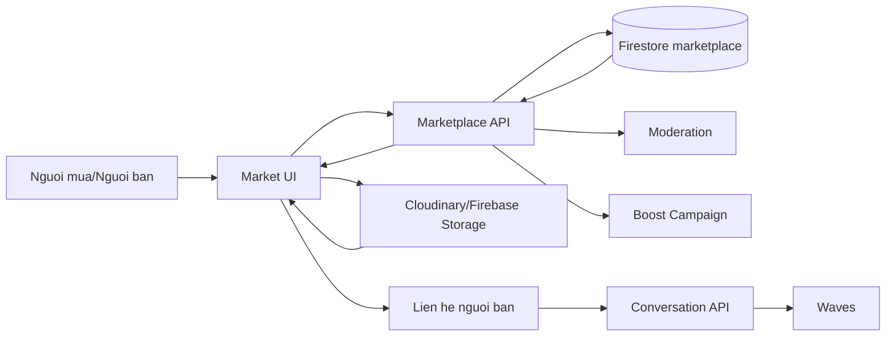

Giai thich khi trinh bay:

- Marketplace doc/ghi listing qua `Marketplace API`.
- Anh san pham upload len storage, API luu URL vao listing.
- Nut `Nhan tin nguoi ban` tao/lay conversation, sau do chuyen sang Waves.
- Boost va moderation la cac xu ly phu gan voi listing.

## 5. DFD Bac 0 - Context Diagram

### 5.1. Bieu do nay dung de lam gi?

DFD bac 0 chi co mot process lon: `He thong SurfSocialMedia`. Muc dich la cho thay ai/dich vu nao trao doi du lieu voi he thong.

### 5.2. Noi dung nen ve

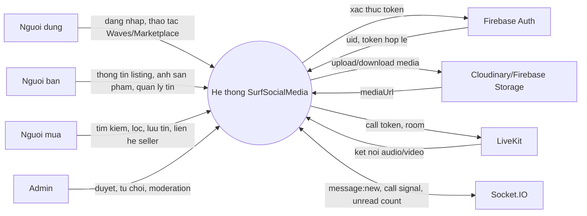

Luon ghi nhan tren mui ten. Vi du:

- `Nguoi dung -> He thong`: `noi dung tin nhan`, `yeu cau goi video`.
- `He thong -> Cloudinary`: `anh chat`, `anh listing`.
- `He thong -> LiveKit`: `callId`, `conversationId`, `mode`.
- `He thong -> Socket.IO`: `message:new`, `call:incoming`, `call:ended`.

## 6. DFD Bac 1 Cho Waves

### 6.1. Bieu do nay dung de lam gi?

DFD bac 1 tach process `Waves` thanh cac process nho hon. Moi process phai co input, output va data store lien quan.

### 6.2. Process va data store

| Ma | Process | Input | Output | Data store/dich vu |
| --- | --- | --- | --- | --- |
| 1.1 | Tai danh sach hoi thoai | `uid` | danh sach conversation | `conversations`, `conversation_members`, `users` |
| 1.2 | Tao DM/group | peerId hoac participantIds | conversation moi/cu | `conversations`, `conversation_members` |
| 1.3 | Gui tin nhan | `conversationId`, text/media | message moi | `messages`, `conversations`, `Socket.IO` |
| 1.4 | Nhan realtime | socket event | UI cap nhat | `Socket.IO` |
| 1.5 | Danh dau da doc | `conversationId`, `uid` | read receipt, unread count | `conversation_members`, `messages` |
| 1.6 | Tim kiem tin nhan | keyword | danh sach message | `messages` |
| 1.7 | Gui media | file anh/audio/file | `mediaUrl` | `Cloudinary/Firebase Storage`, `messages` |
| 1.8 | Goi audio/video | `callId`, `conversationId`, mode | call token, call log | `LiveKit`, `Socket.IO`, `messages`, `notifications` |

### 6.3. Mau DFD bac 1

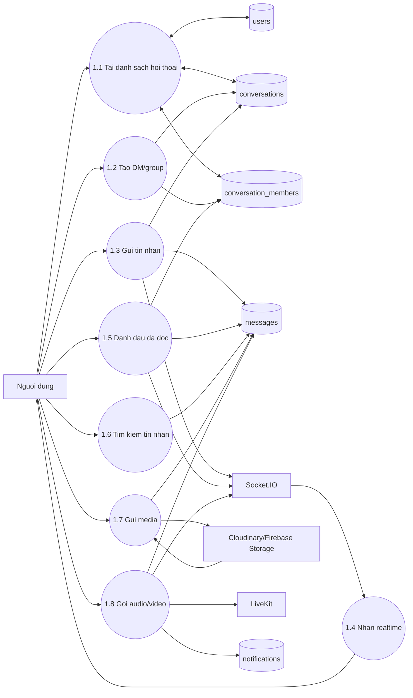

### 6.4. Loi thuong gap

- Khong noi `Gui tin nhan` voi `Socket.IO`: se thieu realtime.
- Chi ve `messages` ma quen `conversations`: khi gui tin nhan, conversation can cap nhat preview/lastMessageAt.
- Ve LiveKit nhu database: LiveKit la external service, khong phai data store.

## 7. DFD Bac 1 Cho Marketplace

### 7.1. Process va data store

| Ma | Process | Input | Output | Data store/dich vu |
| --- | --- | --- | --- | --- |
| 2.1 | Tao listing | title, price, category, description, location | listing moi | `marketplace` |
| 2.2 | Upload anh | file anh | mediaUrls | `Cloudinary/Firebase Storage` |
| 2.3 | Duyet danh sach | category, cursor, tab | listing list | `marketplace` |
| 2.4 | Tim/loc | keyword, category, price, location | ket qua | `marketplace` |
| 2.5 | Xem chi tiet | listingId | listing detail, seller info | `marketplace`, `users` |
| 2.6 | Luu listing | listingId, uid | saved/unsaved | `marketplace.savedBy` |
| 2.7 | Lien he seller | listingId, message | conversation/message | `conversations`, `messages`, `Socket.IO` |
| 2.8 | Bao cao | reason, details | reportId | `marketplace_reports` |
| 2.9 | Boost | boostPlan, payment info | boost campaign | `boost_campaigns`, `marketplace` |
| 2.10 | Moderation | approve/reject/rerun AI | status moi | `marketplace` |

### 7.2. Mau DFD bac 1

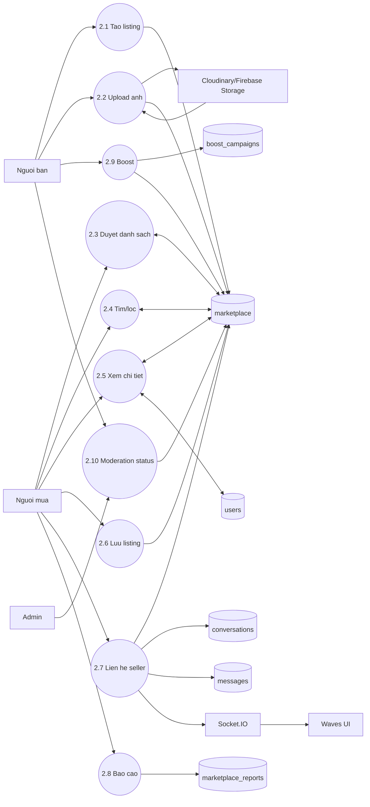

### 7.3. Diem noi quan trong voi Waves

Khi ve `Lien he seller`, khong ve nhu mot message rieng cua Marketplace. Trong code, thao tac nay tao hoac lay conversation co context marketplace, co the gui message dau tien, emit realtime, sau do Waves hien thi thread co card listing.

## 8. Use Case Diagram

### 8.1. Bieu do nay dung de lam gi?

Use case diagram cho thay tung actor duoc phep lam gi. Khong the hien chi tiet API hay database.

### 8.2. Actor

| Actor | Mo ta |
| --- | --- |
| User | Nguoi dung da dang nhap, co the nhan tin va xem marketplace |
| Buyer | User dang mua/xem/lien he seller |
| Seller | User dang tao va quan ly listing |
| Group Member | Thanh vien group chat |
| Admin | Nguoi duyet/report/moderation marketplace |
| External Service | Firebase Auth, Socket.IO, Cloudinary, LiveKit; thuong khong can dua vao use case neu giao vien chi yeu cau actor nguoi |

### 8.3. PlantUML Waves

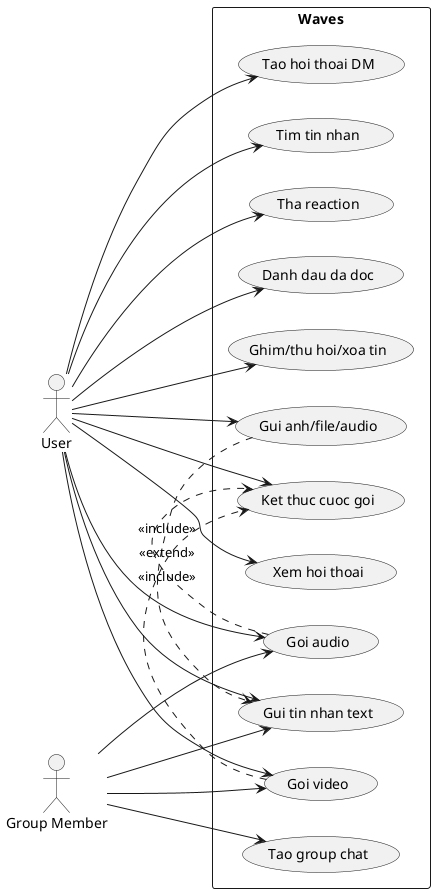

### 8.4. PlantUML Marketplace

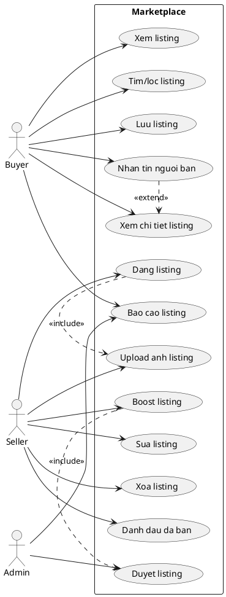

Ghi chu:

- `include`: chuc nang A luon can B. Vi du dang listing can upload anh neu form co anh.
- `extend`: chuc nang B co the xay ra them. Vi du xem chi tiet co the nhan tin nguoi ban.

## 9. Activity Diagram

Activity diagram mo ta tung buoc cua mot quy trinh. Nen ve swimlane de tach trach nhiem.

### 9.1. Activity: Gui tin nhan

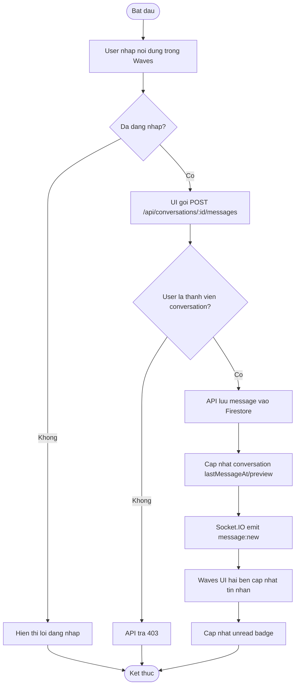

### 9.2. Activity: Goi video

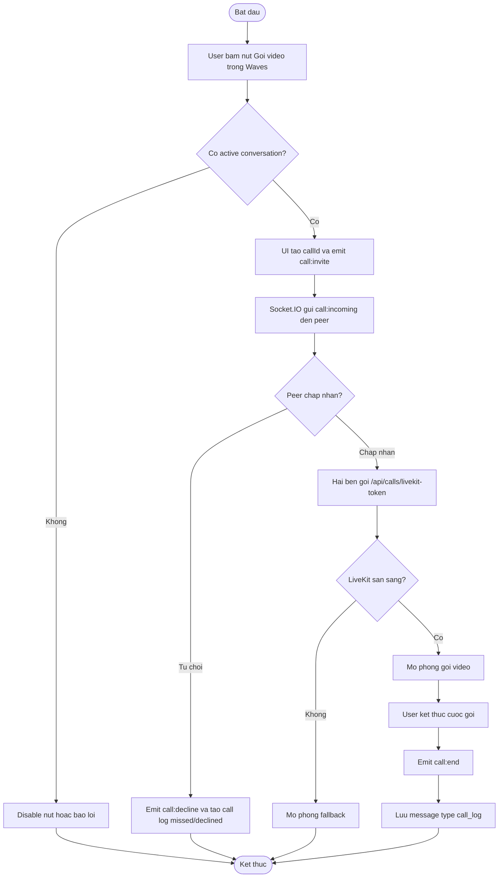

### 9.3. Activity: Tao group chat

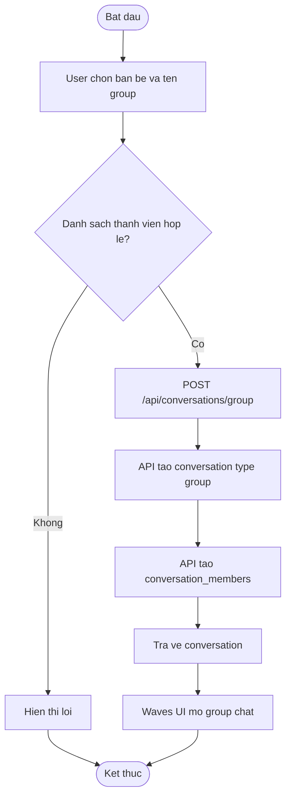

### 9.4. Activity: Dang marketplace listing

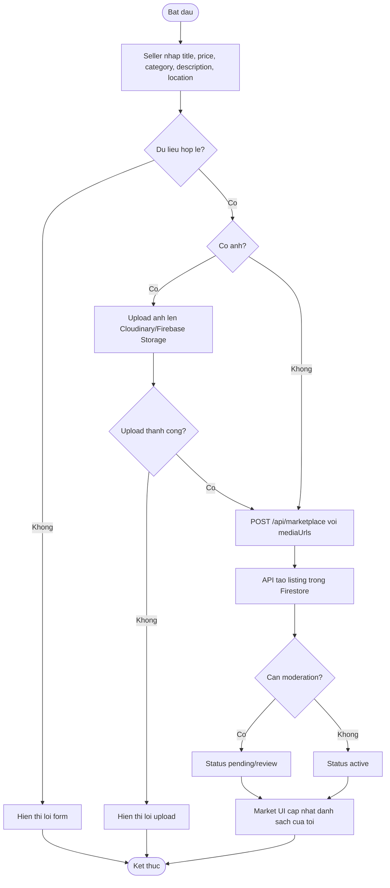

### 9.5. Activity: Lien he nguoi ban

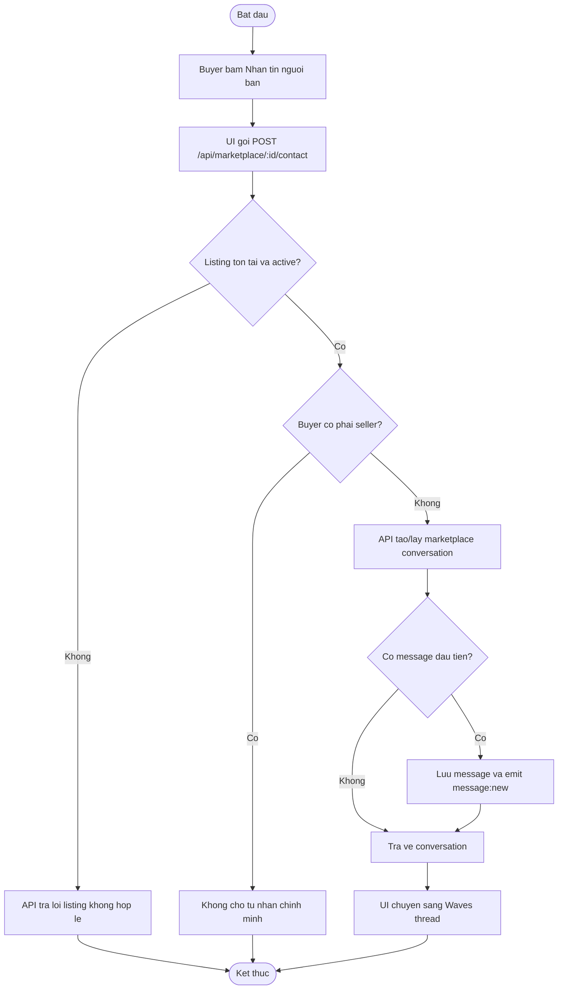

### 9.6. Activity: Bao cao listing

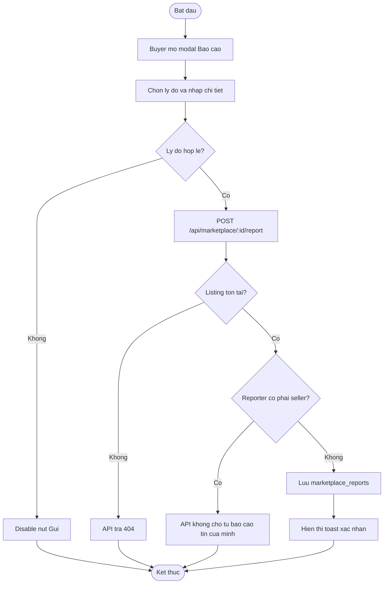

## 10. Sequence Diagram

Sequence diagram mo ta thu tu goi giua cac doi tuong theo thoi gian. Moi sequence nen co actor, UI, API, database va service lien quan.

### 10.1. Gui tin nhan realtime

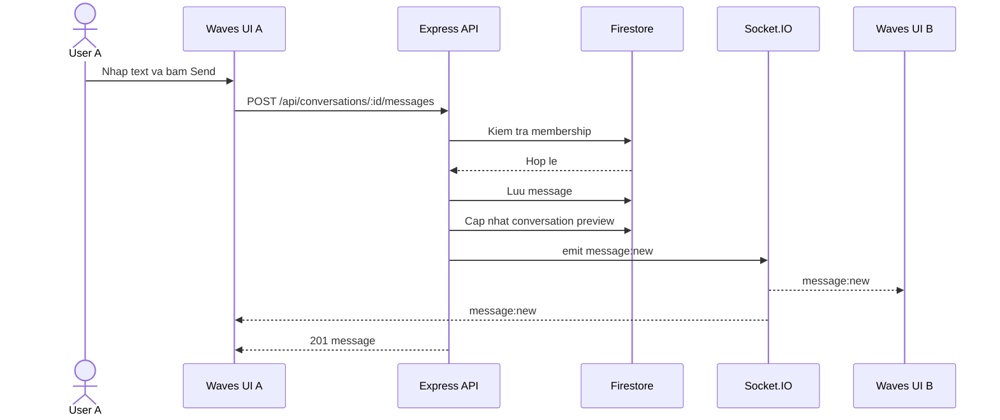

### 10.2. Danh dau da doc

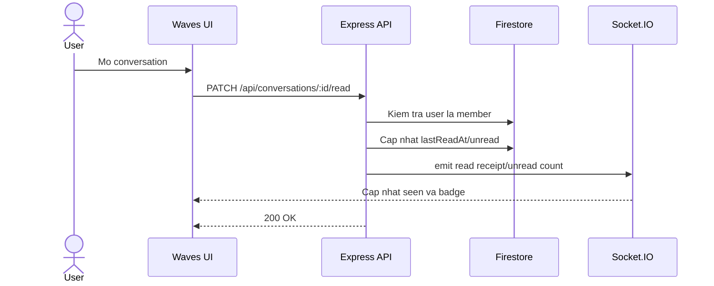

### 10.3. Goi video

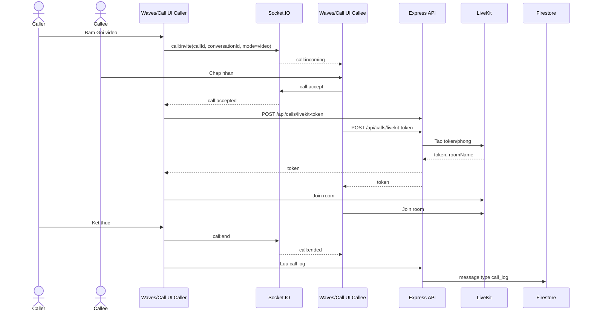

### 10.4. Gui media trong Waves

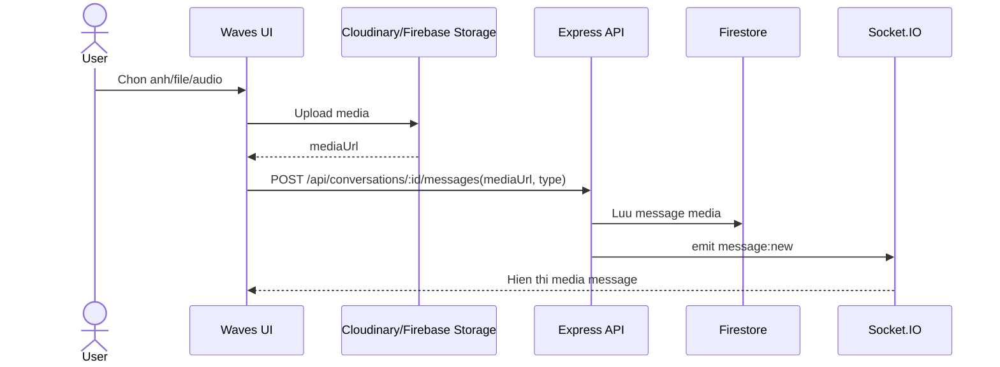

### 10.5. Dang listing Marketplace

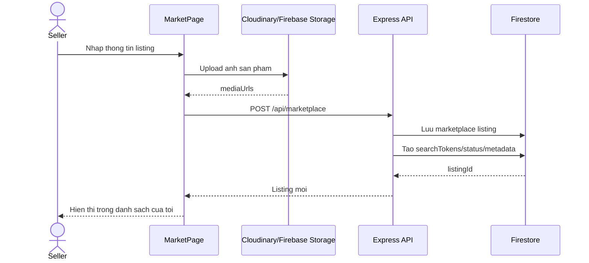

### 10.6. Tim kiem va loc listing

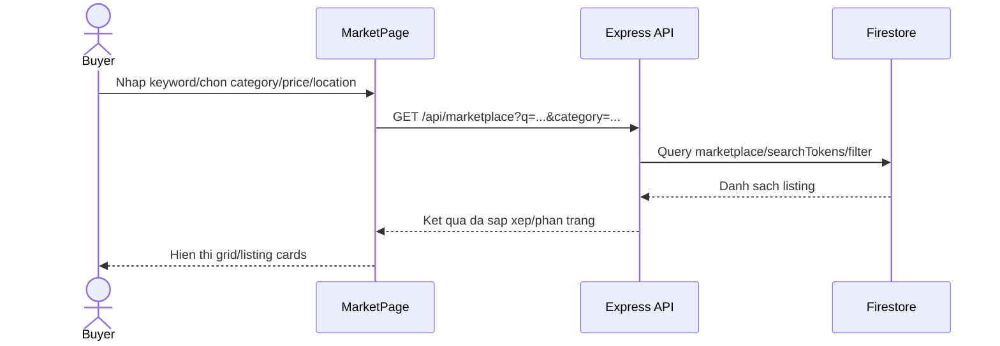

### 10.7. Xem chi tiet listing

```mermaid
sequenceDiagram
  actor Buyer as Buyer
  participant UI as MarketPage
  participant API as Express API
  participant DB as Firestore

  Buyer->>UI: Bam listing
  UI->>API: GET /api/marketplace/:id
  API->>DB: Doc listing
  API->>DB: Doc seller info va ghi metric view/click
  DB-->>API: Listing detail
  API-->>UI: Anh, gia, mo ta, seller, status
  UI-->>Buyer: Mo modal/trang chi tiet
```

### 10.8. Lien he seller qua Waves

```mermaid
sequenceDiagram
  actor Buyer as Buyer
  participant Market as MarketPage
  participant API as Express API
  participant DB as Firestore
  participant Socket as Socket.IO
  participant Waves as Waves UI
  participant SellerUI as Seller Waves UI

  Buyer->>Market: Bam Nhan tin nguoi ban
  Market->>API: POST /api/marketplace/:id/contact
  API->>DB: Doc listing va sellerId
  API->>DB: Tao/lay marketplace conversation
  opt Buyer gui message dau tien
    API->>DB: Luu message
    API->>Socket: emit message:new
    Socket-->>SellerUI: message:new
  end
  API-->>Market: conversation
  Market->>Waves: Navigate/open thread
```

### 10.9. Boost listing

```mermaid
sequenceDiagram
  actor Seller as Seller
  participant UI as MarketPage
  participant API as Express API
  participant DB as Firestore

  Seller->>UI: Chon goi boost
  UI->>API: POST /api/marketplace/:id/boost
  API->>DB: Kiem tra listing owner va status active
  API->>DB: Tao boost_campaign
  API->>DB: Cap nhat listing boostEnabled/boostStatus/boostPlan
  API-->>UI: Boost campaign info
  UI-->>Seller: Hien thi trang thai boost
```

### 10.10. Report listing

```mermaid
sequenceDiagram
  actor Buyer as Buyer
  participant UI as MarketPage
  participant API as Express API
  participant DB as Firestore

  Buyer->>UI: Chon ly do bao cao
  UI->>API: POST /api/marketplace/:id/report
  API->>DB: Doc listing
  API->>DB: Kiem tra reporter khong phai seller
  API->>DB: Luu marketplace_reports
  API-->>UI: reportId
  UI-->>Buyer: Toast xac nhan
```

## 11. Class Diagram

### 11.1. Bieu do nay dung de lam gi?

Class diagram cho thay cac doi tuong du lieu chinh, thuoc tinh chinh va moi quan he. Voi du an nay, nen ve o muc entity/domain, khong can ve tung React component.

### 11.2. Class diagram mau

```mermaid
classDiagram
  class User {
    +string uid
    +string displayName
    +string photoURL
    +string email
    +string role
    +Date createdAt
  }

  class Conversation {
    +string id
    +ConversationType type
    +string title
    +string lastMessageText
    +Date lastMessageAt
    +MarketplaceContext marketplace
  }

  class ConversationMember {
    +string conversationId
    +string uid
    +string role
    +Date joinedAt
    +Date lastReadAt
    +number unreadCount
  }

  class Message {
    +string id
    +string conversationId
    +string senderId
    +MessageType type
    +string text
    +string mediaUrl
    +string fileName
    +Date createdAt
    +CallLogMode callMode
    +CallLogOutcome callOutcome
  }

  class CallSession {
    +string callId
    +string conversationId
    +string fromUserId
    +string toUserId
    +CallMode mode
    +string status
    +Date startedAt
    +Date endedAt
  }

  class MarketplaceListing {
    +string id
    +string sellerId
    +string title
    +number price
    +string description
    +string category
    +string condition
    +string location
    +string[] mediaUrls
    +ListingStatus status
    +string[] savedBy
    +boolean boostEnabled
    +string boostStatus
  }

  class MarketplaceContext {
    +string kind
    +string listingId
    +string title
    +string imageUrl
    +number price
    +string buyerId
    +string sellerId
  }

  class MarketplaceReport {
    +string id
    +string listingId
    +string reporterId
    +string sellerId
    +string reason
    +string details
    +Date createdAt
  }

  class BoostCampaign {
    +string id
    +string listingId
    +string sellerId
    +string plan
    +string status
    +number budgetTotal
    +Date startedAt
    +Date endsAt
  }

  User "1" --> "0..*" ConversationMember
  Conversation "1" --> "1..*" ConversationMember
  Conversation "1" --> "0..*" Message
  User "1" --> "0..*" Message : sends
  Conversation "0..1" --> "1" MarketplaceContext
  User "1" --> "0..*" MarketplaceListing : sells
  MarketplaceListing "1" --> "0..*" MarketplaceReport
  MarketplaceListing "1" --> "0..1" BoostCampaign
  MarketplaceListing "1" --> "0..*" MarketplaceContext
  Conversation "1" --> "0..*" CallSession
```

### 11.3. Enum nen ghi ben canh class diagram

```text
ConversationType = dm | group
MessageType = text | image | file | audio | call_log
CallLogMode = audio | video
CallLogOutcome = completed | missed | declined | cancelled | failed
ListingStatus = active | sold | deleted | pending | rejected
BoostStatus = awaiting_moderation | active | paused | completed | cancelled | rejected
```

## 12. Goi Y Cach Ve Bang Draw.io

Neu khong dung Mermaid/PlantUML, co the ve bang draw.io theo cach sau:

1. Tao file moi, chon template blank.
2. Bat thu vien `UML`, `Flowchart`, `Entity Relation`.
3. Voi DFD:
   - External actor: hinh chu nhat.
   - Process: hinh tron hoac rounded rectangle.
   - Data store: hinh database/cylinder.
   - Data flow: connector co arrow va label.
4. Voi activity:
   - Dung swimlane ngang hoac doc: `User/UI`, `API Server`, `Firestore`, `Socket.IO`, `External Service`.
   - Moi buoc la mot rounded rectangle.
   - Re nhanh dung diamond.
5. Voi sequence:
   - Dung UML Sequence.
   - Lifeline theo thu tu: actor, UI, API, DB, Socket, external service.
6. Voi class:
   - Dung UML Class.
   - Chi ghi thuoc tinh chinh, khong can ghi tat ca field.

## 13. Checklist Tu Cham Diem

Truoc khi nop bao cao, doi chieu checklist nay:

- [ ] FDD/BFD co du hai nhanh `Waves` va `Marketplace`.
- [ ] DFD bac 0 co actor nguoi dung, seller/buyer/admin va external services.
- [ ] DFD bac 1 Waves co `Socket.IO`, `messages`, `conversations`, `LiveKit`.
- [ ] DFD bac 1 Marketplace co `marketplace`, `marketplace_reports`, `boost_campaigns`, va luong `Lien he seller -> Waves`.
- [ ] Use case co du actor `Buyer`, `Seller`, `Admin`, `User/Group Member`.
- [ ] Activity diagram co it nhat 6 luong: gui tin nhan, goi video, tao group chat, dang listing, lien he seller, bao cao listing.
- [ ] Sequence diagram co du luong Waves va Marketplace quan trong.
- [ ] Class diagram co `User`, `Conversation`, `ConversationMember`, `Message`, `CallSession`, `MarketplaceListing`, `MarketplaceReport`, `BoostCampaign`.
- [ ] Cac API ghi trong bieu do khop voi repo: `/api/conversations`, `/api/conversations/:id/messages`, `/api/calls/livekit-token`, `/api/marketplace`, `/api/marketplace/:id/contact`, `/api/marketplace/:id/save`, `/api/marketplace/:id/report`.

## 14. Cach Trinh Bay Trong Bao Cao

Thu tu de trong bao cao nen la:

1. Gioi thieu pham vi Waves va Marketplace.
2. Phan ra chuc nang FDD/BFD.
3. BFD muc module.
4. DFD bac 0.
5. DFD bac 1 Waves.
6. DFD bac 1 Marketplace.
7. Use case diagram.
8. Activity diagrams.
9. Sequence diagrams.
10. Class diagram.

Khi thuyet minh, moi bieu do nen co 3 cau:

- Bieu do nay mo ta muc nao cua he thong.
- Actor/process/data store chinh la gi.
- Luong quan trong nhat la gi.

Vi du thuyet minh cho `Lien he seller`:

> Khi nguoi mua bam Nhan tin nguoi ban, Marketplace API doc listing, kiem tra nguoi mua khong phai seller, tao hoac lay conversation co context marketplace, neu co message dau tien thi luu vao messages va emit `message:new`. Sau do UI chuyen nguoi mua sang Waves de tiep tuc trao doi.

## 15. Mac Dinh Va Gia Dinh

- Dung ten module theo web app: `Waves` cho nhan tin/goi, `Marketplace` cho cho dien tu.
- Firestore la kho du lieu chinh.
- Cloudinary/Firebase Storage la noi luu media.
- Socket.IO xu ly realtime.
- LiveKit xu ly call audio/video.
- Tai lieu uu tien phuc vu bao cao phan tich thiet ke, nen mo ta theo nghiep vu va entity chinh thay vi liet ke tung dong code.
